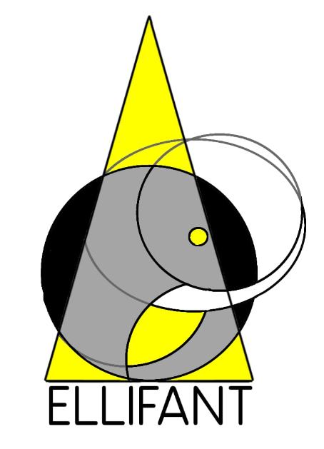

# ELLIFANT documentation - An application for all your r-table ellipsoid fitting needs

**ELLIpsoid Fitting and Adjusting Numeric Tool**, or ELLIFANT, is a python application that allows users to adjust ellipsoids to their r-table measurements, and find the best fitting partitions for their data.

For this guide, basic understanding of what an r-table is and how it is used is assumed. For more information on r-tables, please refer to the CIE 144 standard document, which can be found on the [CIE website](https://cie.co.at/publications/cie-1442001-practical-methods-construction-colour-appearance-tables-rgb-cmyk-and-cie).

We also assume good knowledge of the 2020 paper by Ana Ogando-Martinez *et al.* , which describes the ellipsoid fitting algorithm that serves as a basis for this application.

## Installation

To install ELLIFANT, simply clone the repository and put it in a directory of your choice.
You will need to have Python 3.11 or higher installed on your machine, and use pip or conda to install the following packages:

- numpy
- pandas 
- matplotlib
- argparse

Further instructions on how to install these packages can be found on their respective websites:

- [Python](https://www.python.org/downloads/)
- [pip](https://pip.pypa.io/en/stable/installing/)

Pip should be all you need to install the 5 packages,
just type `pip install <package_name>` in your terminal once you have installed Python and pip.

## Usage

ELLIFANT is a command line application, so you will need to use your terminal to run it.

Use `cd` to navigate to the directory where you have installed ELLIFANT, and down into the src folder.

To run ELLIFANT, simply type `python3 ellifant.py` in your terminal. 
For windows machines, you may need to type `py ellifant.py` instead.

But most likely, this will return you an error message, as you need to specify what data you want it to run on and what you want it to do with it, adding the -help flag will show you the different options you have, but here is a quick rundown of the arguments you can use.

You can put all command line arguments in any order you like, some values will return errors, but the order of the arguments themselves does not matter.

You can use either the short or long and comprehensive version of the arguments, for example, -ea and --ellipsoidAdjusting are interchangeable.

Once you are happy with a result from a computation, make sure to save it, as the results are not saved by default, and will be overwritten if you run another computation. This is to avoid having to delete old results manually, and acumulating a lot of useless data because of a loose command line call.

## Functions

The app has 2 main functions, fitting ellipses and searching for the best fitting partitions, either along the beta vector or over the whole r-table. (see the report for more information on the algorithm)

- -ea | --ellipsoidAdjusting : Adjusts the ellipsoids to the r-table measurements according to the stops vector or a partition

- -bga | --betaGeneticAlgorithm : Searches for the best fitting partition of beta for the provided data using a genetic algorithm

- -pga | --partitionGeneticAlgorithm : Searches for the best fitting partition of the whole r-table for the provided data using a genetic algorithm

You must specify one and only one of these functions per command line call.

#### Boolean arguments (no value needed, typing them will set them to True)

Do not forget the -sd argument if you want to save your results ! 

- -sd | --saveData : Saves the results of your computations in different formats depending on what you requested, the files will be saved in the results folder of the application (or the folder you specified with the -sf argument).

- -si | --saveImages : Saves the images you want according to the plotTypes and styles you requested, the images will be saved in the images folder of the application.

- -sh | --showImages : Shows the matplotlib plots as they are computed, this is useful if you want to see the plots but do not want to save them, this is compatible with the saveImages argument.

- -fc | -- freeConstant : This is a boolean to determine weather or not you want to use the free constant in the ellipsoid fitting algorithm, it is false if you don't specify it.

- -ct | --coloredOriginalTable : This is a boolean to determine weather or not you want to color the original r-table according to the partition you use, it is false if you don't specify it. This is useful if you want to see how the partition you are using affects the r-table.

- -cz | --conserveZeros : If you want to keep the historical zeros of r-tables in the results of your computations, you can use this argument, it is false if you don't specify it. This of course brings down the error of the ellipsoid fitting.

- -v | --verbose : makes the application print more information about what it is doing, this is useful if you want to see the progress of the computations, but it can be a bit overwhelming if you are running a lot of files.

## More command line arguments

- -fp | --folderPath : Path to the folder containing the r-tables you want to run ELLIFANT on, the path should be relative to the data folder of the application, ELLIFANT comes with a few databases to toy with, but you can add your own next to them.

- -p | --patron : Patron of the .xlsx folders you want to run ELLIFANT on, for example, `-p *.xlsx` is the default value, since the app only parses excel files, but you can specify a more specific patron, for example, `-p *-rtable.xlsx` will only run ELLIFANT on files that end with -rtable.xlsx

- -s | --sheets : If you only want to parse a few sheets of the files, you cans specify them here, for example, `-s R1,R2,R3` will only parse the sheets R1, R2 and R3 of the files.

- -i | --ignore : This is the opposite of the sheets argument, it allows you to ignore certain sheets, for example, `-i R1,R2,R3` will parse all sheets except R1, R2 and R3. Sheets named `Feuil1` are ignored by default, as they are usually used as info about a database.

- -sf | --saveFolder : This is the folder where the results of your computations will be saved, it is the results folder of the application by default, but you can specify a different folder if you want to.

- -sif | --saveImagesFolder : This is the folder where the images of your computations will be saved, it is the images folder of the application by default, but you can specify a different folder if you want to.

- -sdn | --saveDataName : This is the name of the file where the results of your computations will be saved, it defaults to `results`.

- -pa | --partition : This describes how you want to partition your data, it defaults to `0,15,60,180` just like in the paper, but you can specify a different partition if you want to, for example, `-pa 0,15,90,180` is known to be the optimal partition for r-tables on dry 
road surfaces.

- -g | --genetic : This is a vector of three values that controls the genetic algorithm, the first value is the number of ellipses you want to fit to the r-table, the second value is the number of generations one individual has to win in a row to be considered the best (the genetic algorithm always terminate at 10,000 generations), and the third value is the number of individuals you want to have in your population, it defaults to `3,5,30` as to not use up too many ressources, but to get satisfying results, you should use at least `n,20,100` for any n.

- -ps | --plotStyle : This is the style of plot you want to save or show with matplotlib, it defaults to a 2d side view plot, but you can specify a different style if you want to, for example, `-ps 2D_top` will plot the photometric solids from the top, and `-ps 3D` will plot the photometric solids in 3D. Additionally, adding `q` before the style will plot the photometric solids for the corresponding q table instead of the r table, for example, `-ps q2D_side` will plot the standard 2D side view plot for the q table.

- -pt | plotTypes : This controls what you want to plot: `-pt o` will plot the original r-table, `-pt r` will plot the resulting r-table after the fitting of ellipsoids, and `-pt c` will plot a comparison between the original and resulting r-tables. You can combine these arguments, for example, `-pt or` will work just as you would expect it to.

## Outputs

Any and all outputs of the application will be saved in the results folder of the application, or the folder you specified with the -sf argument.

- The results of the ellipsoid fitting will be saved in three excel files, one with the parameter calculations of the ellipsoids, one with the results of the fitting, and one with the parameters of the ellipsoids. A txt file with the command line arguments will also be saved, to keep track of what you did.

- The results of the genetic algorithm will be saved in an excel file, with the best individual of the algorithm, a png format image of the best individual, and a txt file with the time it took to run the algorithm.

## Examples

- To see your favourite r-table in 3D, just type `python3 ellifant.py -ea -fp <path_to_your_file> -p <your_excel_file> -s <your sheet> -pt o -ps 3D -sh` in your terminal.

- To see the results of the ellipsoid adjusting on your r-table in 2D from the top, just type : `python3 ellifant.py -ea -fp <path_to_your_file> -p <your_excel_file> -s <your sheet> -pt r -ps 2D_top -sh` in your terminal.

- To look for the best partition to sum up the r-tables from your database, just type : `python3 ellifant.py -pga -fp <path_to_your_directory> -g 3,5,30 -sd -si` in your terminal.

- To test on five ellipsoids with the best models and zero padding, `py ellifant.py -ea -cz -fp DryAll -p *.xlsx -pa part/Dry.xlsx -sd` This is what we recommend to do for the best results.